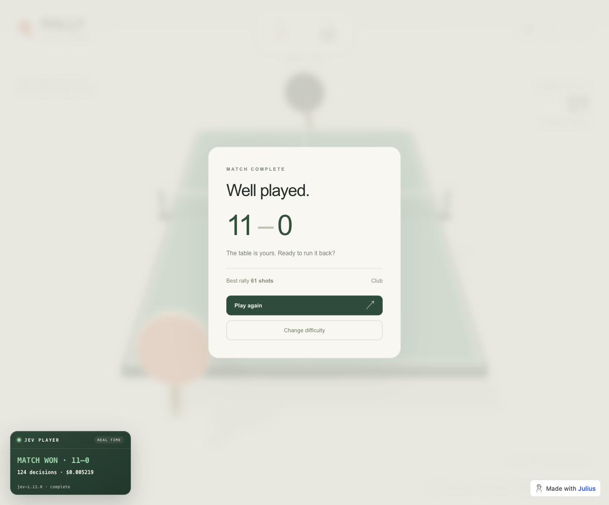

# Jev plays RALLY — in real time

A small, auditable example of [TypeSafe AI's Jev](https://typesafe.ai/) playing
a live browser game. Jev reads structured table-tennis telemetry, chooses every
serve and return, and moves the visible racket through ordinary Chrome input.



The interesting part is not table tennis. It is the reusable control boundary:
deterministic code observes and executes; Jev makes narrow, typed decisions.
The repository is intentionally dependency-free and documented so a person or
coding agent can adapt the pattern to another game or interactive task.

## Verified result

One recorded Club-difficulty run completed without pausing game physics:

| Measure | Result |
| --- | ---: |
| Outcome | **Jev won 11–0** |
| Timing mode | Real-time, no inference pauses |
| Decisions | 124 |
| Late actions | 0 |
| Median / maximum API latency | 325 ms / 889 ms |
| Elapsed wall time | 269.031 seconds |
| Input / output tokens | 124,258 / 8,631 |
| API cost | **$0.005218836** |
| Returned model | `jev-1.13.0` |

See [the complete verification notes](docs/VERIFIED_RUN.md). This is one
demonstration, not a benchmark or win-rate claim.

## What Jev controls

For each serve, Jev chooses left, center, or right. For each incoming return,
two independent `Choice` questions select:

- centered, left-angled, or right-angled racket contact;
- controlled or power pace.

The questions are sent together in one System One request. Code calculates the
trajectory and safe contact geometry, but it executes only Jev's returned
choices—there is no scripted policy that replaces them.

```text
game telemetry -> structured JSON -> Jev Choice decisions
      -> response validation -> normal mouse/keyboard input -> game physics
```

Jev does not receive screenshots. The hosted game's public `?test=1` mode
provides player-visible structured telemetry, following the same pattern used
by the linked Mario and StarCraft examples.

## Quick start

### 1. Clone

```sh
git clone https://github.com/Icohen007/jev-play-ping-pong.git
cd jev-play-ping-pong
```

### 2. Requirements

- Node.js 22 or newer
- Google Chrome
- A TypeSafe API key from [console.typesafe.ai](https://console.typesafe.ai/)

There are no npm dependencies to install.

### 3. Configure the API key

```sh
cp .env.example .env
```

Put your key in `.env`, then restrict the file on macOS/Linux:

```sh
chmod 600 .env
```

You may instead export `TYPESAFE_API_KEY`. `TYPESAFE_MODEL` is optional and
defaults to `jev-latest`.

### 4. Start Chrome with remote debugging

macOS:

```sh
/Applications/Google\ Chrome.app/Contents/MacOS/Google\ Chrome \
  --remote-debugging-port=9222 \
  --user-data-dir=/tmp/jev-chrome \
  --no-first-run --no-default-browser-check &
```

Linux:

```sh
google-chrome \
  --remote-debugging-port=9222 \
  --user-data-dir=/tmp/jev-chrome \
  --no-first-run --no-default-browser-check &
```

Windows PowerShell:

```powershell
& "$env:ProgramFiles\Google\Chrome\Application\chrome.exe" `
  --remote-debugging-port=9222 `
  --user-data-dir="$env:TEMP\jev-chrome" `
  --no-first-run --no-default-browser-check
```

Keep that Chrome window open. The controller attaches to it, navigates the
current page to RALLY, displays Jev's decisions in a fixed overlay, and leaves
the browser open afterward.

### 5. Play

```sh
npm run play
```

Real-time play is the default. Useful options:

```sh
npm run play -- --level pro --max-seconds 420
npm run play -- --pause                 # freeze physics only during inference
npm run play -- --env-file /path/to/private.env
npm run play -- --help
```

The `--pause` mode is useful for reproducing decisions on slow or variable
networks. A return crosses the table in roughly 0.85–0.94 seconds, so real-time
success depends partly on end-to-end latency.

## Evidence and cost

Every run creates an ignored `artifacts/run-<timestamp>.jsonl` file containing:

- exact model state and typed questions;
- returned choices, probabilities, confidence, and model version;
- latency, retry count, and token usage;
- whether each time-sensitive action executed;
- point outcomes, final score, elapsed time, and calculated cost.

Summarize a run with:

```sh
npm run summarize -- artifacts/run-<timestamp>.jsonl
```

The checked-in price is the current published Jev rate: **$0.042 per million
input tokens; output tokens are free**. Pricing can change, so verify it against
[the current model documentation](https://docs.typesafe.ai/models) before using
cost estimates in production.

## Record a demo

On macOS or Linux, with
[`playwright-cli`](https://github.com/microsoft/playwright-cli) installed and
the debugging Chrome open:

```sh
npm run record
```

The script records a real-time match and its Jev overlay to
`artifacts/jev-rally-real-time.webm`. When FFmpeg is available it also writes a
share-ready H.264 MP4. Override the paths or 1440×900 capture size with
`JEV_VIDEO_OUTPUT`, `JEV_VIDEO_MP4_OUTPUT`, `JEV_VIDEO_WIDTH`, and
`JEV_VIDEO_HEIGHT`; pass normal controller options after `--`.

## Adapt it

- [Architecture and trust boundary](docs/ARCHITECTURE.md)
- [Step-by-step adaptation guide and coding-agent prompt](docs/ADAPTING.md)
- [Repository instructions for coding agents](AGENTS.md)
- [GitHub launch checklist and LinkedIn draft](docs/LAUNCH.md)

The core pieces are small on purpose:

| File | Responsibility |
| --- | --- |
| `src/game.mjs` | State encoding and legal action mapping |
| `src/typesafe.mjs` | Fail-closed System One client |
| `src/cdp.mjs` | Dependency-free Chrome protocol client |
| `src/browser-game.mjs` | Telemetry, input helpers, and status overlay |
| `src/cli.mjs` | Real-time control loop and evidence recorder |

## Verify

```sh
npm test
npm run check
```

CI runs the same checks on Node.js 22.

## Prior art and attribution

This implementation was informed by:

- [vinnylarouge/jevlike](https://github.com/vinnylarouge/jevlike)
- [phyous/tsai-sc](https://github.com/phyous/tsai-sc)
- [fhshaik/typesafe-mario](https://github.com/fhshaik/typesafe-mario)
- [TypeSafe System One documentation](https://docs.typesafe.ai/introduction)

RALLY is a separately hosted Julius artifact and is not redistributed here.
This project is not affiliated with or endorsed by TypeSafe AI or Julius. It
uses the external game URL as a demonstration target; availability and behavior
may change.

## License

[MIT](LICENSE)
